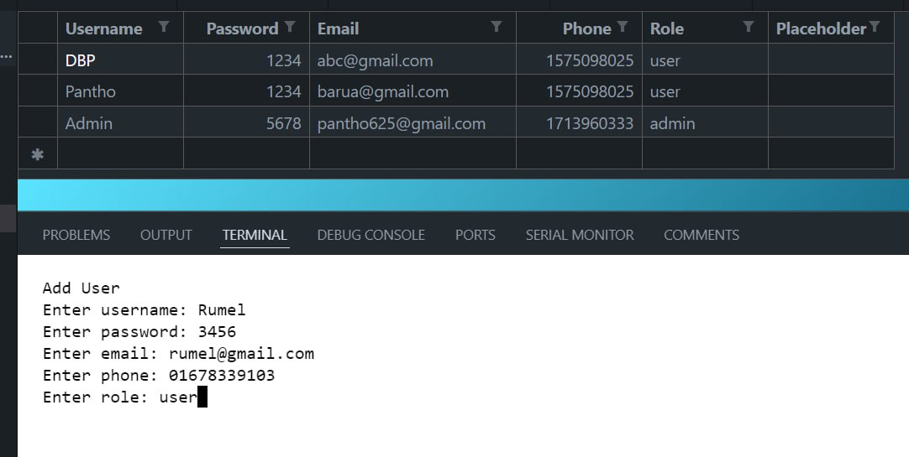
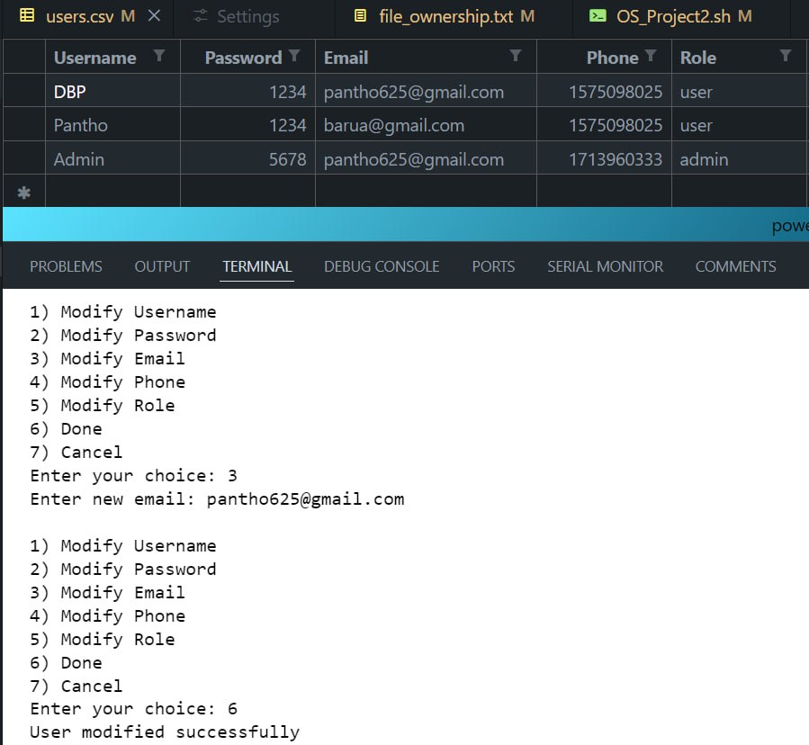

# User-Management-System

The User Management System allows admins to create, update, and delete user accounts, assign roles, and manage permissions securely. It enables users to securely access, update, and delete their own files, ensuring data privacy and control over personal information.

## **Features**
- Users can access their files  within the system and update them.
- Control access right of files to ensure security.
- Find User Lists.
- Adding , removing or modifiying users information.

## **Screenshots**
|    |   |  
|---------------------------------------------------------------------------------|-------------------------------------------------------------------------------|
|     |   |  
|  |    |  
|    |  |  
